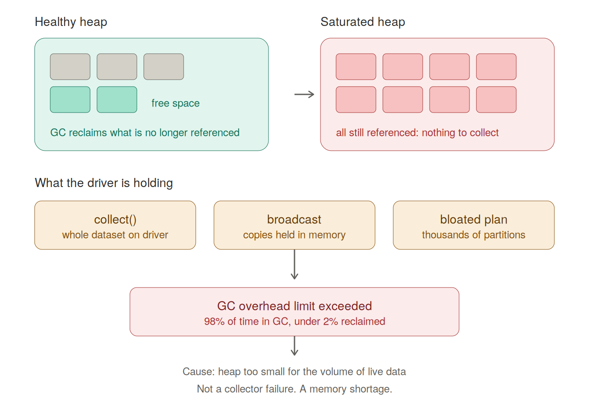

# GC overhead limit exceeded



A JVM-level error that surfaces in Spark driver or executor logs when garbage collection consumes nearly all CPU time while reclaiming almost nothing.

## What the error means

The JVM throws `java.lang.OutOfMemoryError: GC overhead limit exceeded` when both conditions hold across consecutive collections:

- More than **98%** of total CPU time is spent in garbage collection
- Less than **2%** of the heap is recovered

Rather than looping indefinitely in a state where no useful work happens, the JVM gives up and fails fast.

## What garbage collection actually does

The Garbage Collector reclaims memory automatically by identifying objects that no longer have an **active reference** — nothing in the running program points to them anymore. Unlike C or C++, there is no manual deallocation.

Spark runs on the JVM, so every DataFrame, every broadcast variable, and every intermediate structure lives on the heap and is subject to collection.

## The common misreading

The error is often read as "the collector failed to free memory." It didn't.

The GC ran correctly and found **nothing to collect**. Every object on the heap was still referenced — still legitimately in use by the application. There was no garbage.

The real cause is simpler: **the heap is too small for the volume of live data**. This is a memory shortage, not a collector malfunction.

## Where the error occurs matters

The JVM that logs the error tells you which side is under pressure. Driver and executors are separate JVMs with independent heaps and independent GC cycles.

### Driver-side causes

| Pattern | Why it retains memory |
|---|---|
| `collect()` / `toPandas()` | Pulls the entire dataset into driver memory |
| Oversized broadcast variables | Each broadcast is materialized on the driver before distribution |
| Bloated execution plan | Thousands of partitions and stages inflate plan metadata |
| Long-lived references in application code | Accumulating results in a Python list or map across iterations |

### Executor-side causes

| Pattern | Why it retains memory |
|---|---|
| Oversized partitions | One task must hold its entire partition in memory |
| Data skew | A single partition grows disproportionately large |
| Aggressive caching | `MEMORY_ONLY` on a dataset larger than available heap |
| Wide shuffles | Shuffle buffers compete with execution memory |

## Executor sizing trade-off

Heap size affects GC behaviour in opposite directions depending on the failure mode:

| Problem | Preferred configuration |
|---|---|
| Long GC pauses | **Smaller** executors — less heap to scan per collection, and pauses stagger across JVMs |
| OOM from skew | **Larger** executors — a skewed partition must fit in a single executor's heap |

The conventional guidance is to keep executor heap **below ~64 GB**. Above that, full GC pauses become long enough to hurt throughput and risk heartbeat timeouts.

## Mitigation

### Configuration

```bash
# Driver
spark-submit --driver-memory 8g ...
spark.conf.set("spark.driver.memory", "8g")     # must be set before the JVM starts

# Executors
--executor-memory 16g
--conf spark.memory.fraction=0.6                # execution + storage share of heap

# G1GC handles large heaps better than the default parallel collector
--conf "spark.executor.extraJavaOptions=-XX:+UseG1GC"
```

Note that `spark.driver.memory` cannot be changed at runtime from inside an active session — the driver JVM is already running. Set it at submission time or in the cluster configuration.

### Code

Configuration treats the symptom. When the driver runs out of memory, the cause is usually code centralizing data that should stay distributed.

```python
# Retains the full dataset on the driver
rows = df.collect()
for row in rows:
    process(row)

# Stays distributed
df.write.mode("overwrite").parquet(output_path)
```

```python
# Retains every row on the driver
pdf = df.toPandas()

# Only the aggregate crosses back
summary = df.groupBy("region").agg(sum("revenue")).toPandas()
```

Other adjustments worth checking before raising memory:

- Replace `MEMORY_ONLY` with `MEMORY_AND_DISK` where the cached dataset exceeds available heap
- Increase `spark.sql.shuffle.partitions` so individual partitions shrink
- Enable AQE (`spark.sql.adaptive.enabled`) to handle skew and coalesce small partitions at runtime
- Filter and project **before** joins and aggregations so less data stays live

## Diagnosis

The Spark UI **Executors** tab reports GC time per executor alongside task time. A GC-to-task-time ratio above roughly 10% signals memory pressure well before the error is thrown.

For deeper inspection, enable GC logging:

```bash
--conf "spark.executor.extraJavaOptions=-XX:+PrintGCDetails -XX:+PrintGCTimeStamps"
```

## Related

- [Cache and persist storage levels](../cache-persist-storage-levels.md)
