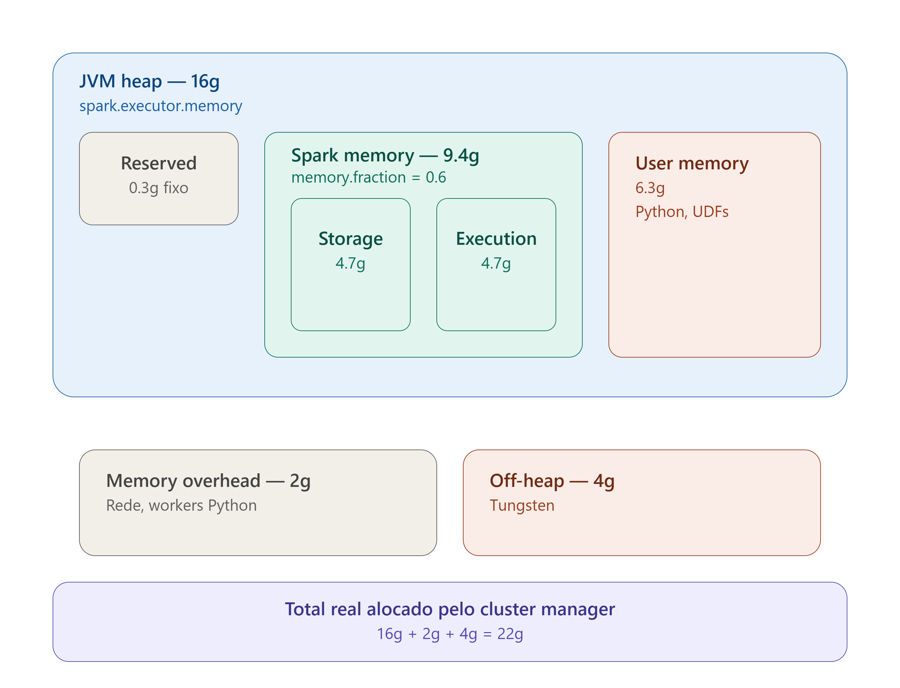

# Anatomy of a Spark Executor's Memory

A Spark Executor's memory isn't a single box — it's a cascade of 5 configs.



## The cascade

```
spark.executor.memory = 16g
```
Sets the total heap size. The starting point — every other config slices this value.

```
spark.memory.fraction = 0.6
```
60% of the heap (after a ~300MB reservation) becomes **Spark Memory**, 40% becomes **User Memory** (Python, UDFs, user-defined data structures).

```
spark.memory.storageFraction = 0.5
```
Within Spark Memory, a 50/50 split between:
- **Storage** — cache, `persist()`, broadcast
- **Execution** — shuffle, sort, joins, aggregations

Storage and Execution aren't rigid compartments: with the Unified Memory Manager (Spark 1.6+), each can borrow space from the other dynamically. Execution has priority under pressure — it can force eviction of cached Storage blocks.

```
spark.executor.memoryOverhead = 2g
```
Buffer **outside** the JVM heap. Covers network, Python processes (PySpark), and native overhead. Default is `max(384MB, 10% of executor.memory)`.

```
spark.memory.offHeap.size = 4g
```
Memory **outside** the JVM's GC, used by the Tungsten Engine for vectorized operations. Reduces garbage collection pressure in large jobs.

## The real total

| Component | Size |
|---|---|
| JVM heap (`executor.memory`) | 16g |
| Memory overhead | 2g |
| Off-heap (Tungsten) | 4g |
| **Total allocated by the cluster manager** | **22g** |

## Why this matters

A "16g" executor, as configured, actually reserves **22g** in reality. Ignoring this cascade is the most common cause of:
- Silent `OutOfMemoryError`s in jobs that "should have fit" within the configured memory
- Undersized cluster capacity planning (sizing only by `executor.memory`, forgetting overhead + off-heap)
- Misdiagnosed GC pressure (blaming lack of heap, when it's actually lack of off-heap space for Tungsten to operate)

Understanding this cascade is the difference between a job that suffers silent OOMs and one that runs stable in production.
